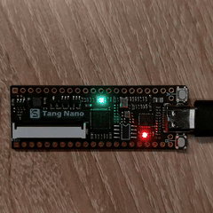

# HNY2026 - New Year's Greeting on FPGA

A Chisel-based FPGA design that transmits a New Year's greeting message via LED patterns on a TangNano 1K development board.

[](./video/video.mp4)

## How It Works

The greeting is encoded as:

- Green LED = bit '0'
- Red LED = bit '1'
- 8-bit ASCII (LSB) + parity bit + empty bit

## FPGA Workflow (TangNano 1K)

**Full build and load to FPGA SRAM:**
```bash
mill tangNano1k.load
```

**Full build and burn FPGA flash:**
```bash
mill tangNano1k.burn
```

**Step-by-step:**
```bash
mill tangNano1k.generate   # Generate SystemVerilog
mill tangNano1k.synth      # Synthesize with Yosys
mill tangNano1k.pnr        # Place and route with Nextpnr
mill tangNano1k.bitstream  # Generate bitstream
mill tangNano1k.load       # Load to FPGA SRAM
mill tangNano1k.burn       # Burn to FPGA flash
```

**Run all unit tests:**
```bash
mill hny2026.test
```

## Requirements

- Scala and [Mill](https://mill-build.org/mill/cli/installation-ide.html)
- [Yosys](https://github.com/YosysHQ/yosys) with [Slang plugin](https://github.com/povik/yosys-slang)
- [Nextpnr](https://github.com/YosysHQ/nextpnr)
- Gowin pack tool (from [Apicula](https://github.com/YosysHQ/apicula) package)
- [openFPGALoader](https://github.com/trabucayre/openFPGALoader)
- [TangNano 1K](https://wiki.sipeed.com/hardware/en/tang/Tang-Nano-1K/Nano-1k.html) development board (GW1NZ-LV1QN48C6/I5)

Yosys and other utilities can be taken from the [OSS CAD Suite](https://github.com/YosysHQ/oss-cad-suite-build) package or installed using the package manager [Nix](https://nixos.org/download/):

```bash
nix-shell shell.nix
```

## Decoding the Message

Capture the LED blinking on video (30 fps recommended), then extract the bit pattern: green=0, red=1.
